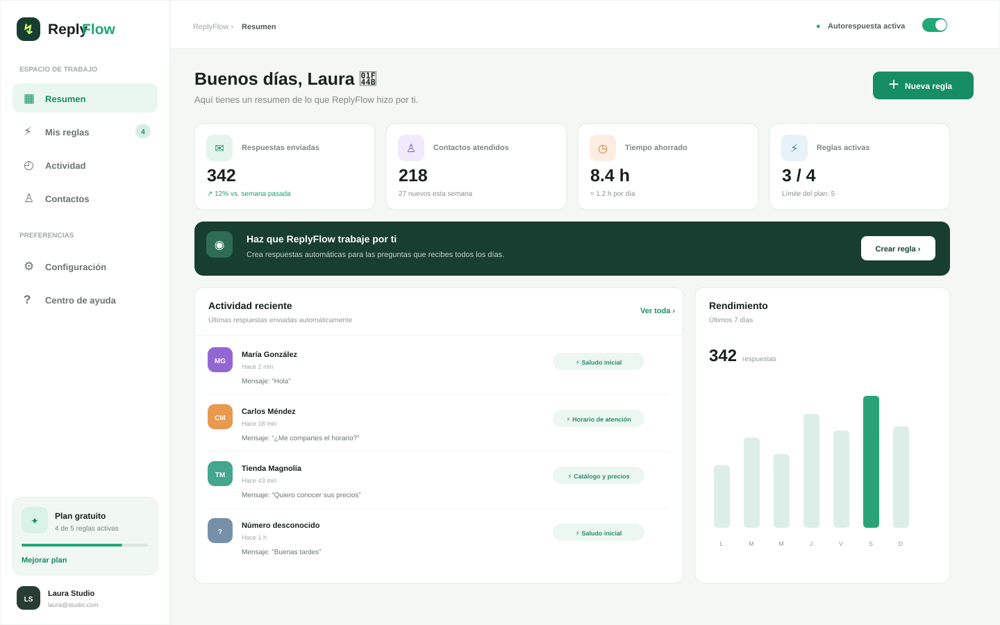
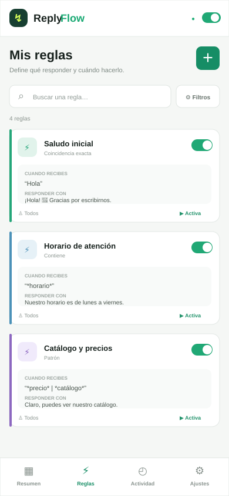

# Capturas de ReplyFlow

> Estas vistas reflejan la interfaz actualmente implementada. No representan todavía una aplicación Android nativa conectada a WhatsApp.

## Escritorio — Resumen

## Móvil — Gestión de reglas

## Vistas incluidas en el prototipo

- Resumen con métricas, actividad reciente y rendimiento.
- Gestión de reglas con activación, edición y eliminación.
- Formulario para crear reglas.
- Historial de actividad.
- Contactos y configuración.
- Navegación adaptada a móvil.
